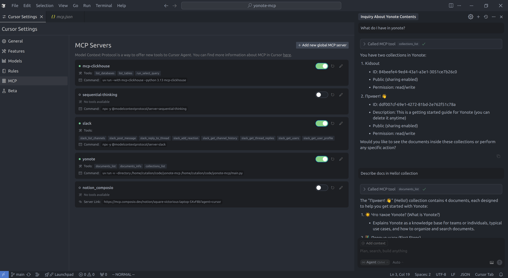

# Yonote MCP Server Prototype
[](https://smithery.ai/server/@cutalion/yonote-mcp)

This is an MVP project of an MCP (Multi-Channel Platform) server for the Yonote service, an alternative to Notion. The server provides API tools to interact with Yonote documents and collections.

## Features

- List documents and collections from Yonote
- Get detailed information about a document
- Exposes tools via the FastMCP framework

## Requirements

- Python 3.13+
- [Yonote API credentials](https://app.yonote.ru/)
- The following Python packages (see `pyproject.toml`):
  - `fast-agent-mcp>=0.2.23`
  - `requests>=2.32.3`
  - `python-dotenv` (for loading environment variables)
- [uv](https://github.com/astral-sh/uv) for dependency management

## Setup

### Installing via Smithery

To install Yonote Document Interaction Server for Claude Desktop automatically via [Smithery](https://smithery.ai/server/@cutalion/yonote-mcp):

```bash
npx -y @smithery/cli install @cutalion/yonote-mcp --client claude
```

### Manual Installation
1. **Clone the repository:**
   ```bash
   git clone <your-repo-url>
   cd yonote-mcp
   ```

2. **Install dependencies using uv:**
   ```bash
   uv pip install -r requirements.txt
   # or, using pyproject.toml:
   uv pip install .
   ```

3. **Configure environment variables:**

   Create a `.env` file in the project root with the following content:
   ```
   API_TOKEN=your_yonote_api_token
   API_BASE_URL=https://app.yonote.ru/api  # Optional, defaults to this value
   ```

## Usage

Run the MCP server:
```bash
python main.py
```

The server exposes the following tools:
- `documents_list`: Get a list of documents (with optional limit, offset, and collectionId)
- `documents_info`: Get info about a document by ID
- `collections_list`: Get a list of collections (with optional limit and offset)

## Project Structure

- `main.py` — Main server code and tool definitions
- `pyproject.toml` — Project metadata and dependencies

## License

MIT (or specify your license)

## Cursor Configuration Example

To use this MCP server with Cursor, add the following to your `~/.cursor/mcp.json` configuration file:

```json
{
  "mcpServers": {
    "yonote": {
      "command": "uv",
      "args": [
        "run",
        "-v",
        "--directory",
        "/path/to/yonote-mcp",
        "/path/to/yonote-mcp/main.py"
      ]
    }
  }
}
```

Replace `/path/to/yonote-mcp` with the actual path to your project directory.


